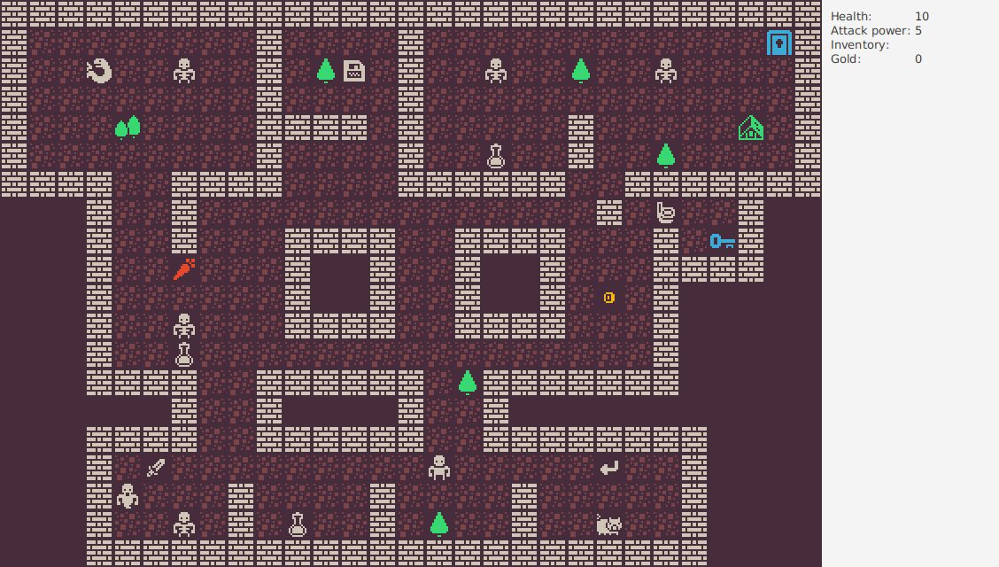
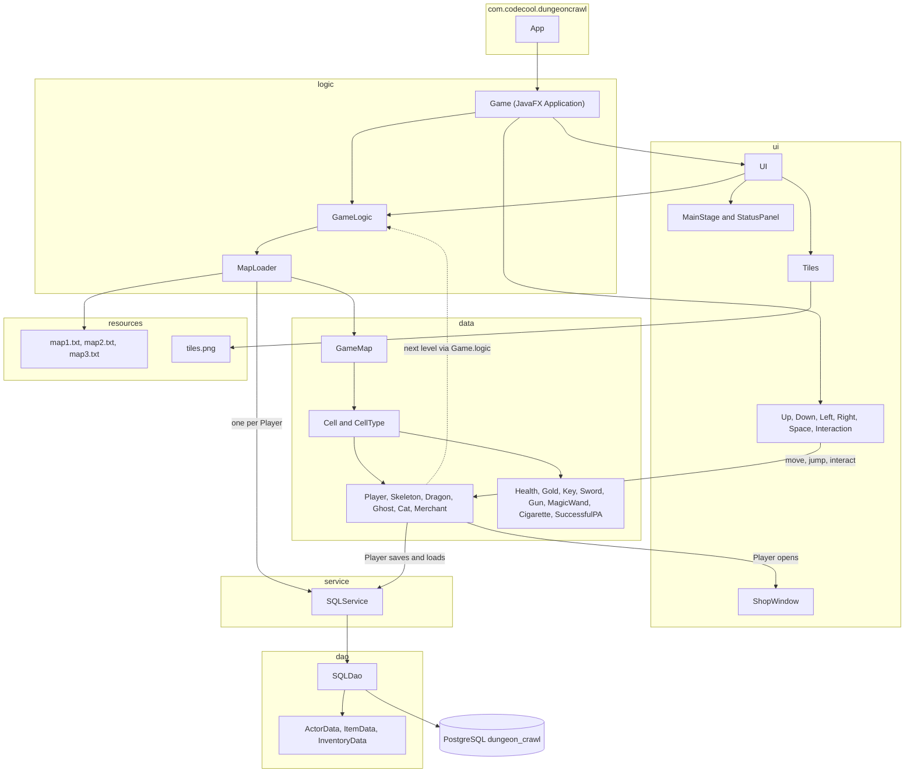

<div align="center">

<h1>⚔️ Dungeon Crawl</h1>
<p>A tile-based JavaFX roguelike with skeletons, a cigarette merchant and save games in PostgreSQL.</p>
<a href="https://adoptium.net/temurin/releases/"></a> <a href="https://openjfx.io/"></a> <a href="https://maven.apache.org/"></a>
<a href="https://www.postgresql.org/"></a> <a href="https://junit.org/"></a> <a href="https://site.mockito.org/"></a>
</div>

<details>
<summary>Table of contents</summary>

- [About the project](#-about-the-project)
- [Built with](#-built-with)
- [Getting started](#-getting-started)
- [How to play](#-how-to-play)
- [How the code fits together](#-how-the-code-fits-together)
- [Saving and loading](#-saving-and-loading)
- [Tests](#-tests)
- [Known bugs](#-known-bugs)
- [Team](#-team)

</details>

## 📖 About the project

We're a four-person team and this is what we built for our second Codecool team sprint. It's a tile-based roguelike in JavaFX: you walk through three levels, poke skeletons until they fall over, buy cigarettes from a merchant and keep your save games in PostgreSQL.

Watch where you step, though. If you're careless you'll flush your sword down the toilet.

## 🧰 Built with

- <a href="https://adoptium.net/temurin/releases/"></a> 
- <a href="https://openjfx.io/"></a> 
- <a href="https://maven.apache.org/"></a>
- <a href="https://www.postgresql.org/"></a> 
- <a href="https://junit.org/"></a> 
- <a href="https://site.mockito.org/"></a>

The pom compiles with source/target 25, and the code itself needs at least 17 (records, pattern-matching `instanceof`, switch expressions). JavaFX is started through `javafx-maven-plugin` 0.0.3, and the artifact is `com.codecool:dungeon-crawl:1.0-SNAPSHOT`.

## 🚀 Getting started

### Prerequisites

This has to run on a normal desktop, because JavaFX opens a real window. Install these four things, then check each one in a terminal.

- <a href="https://adoptium.net/temurin/releases/?version=25"></a> The Java compiler and runtime; it has to be 25, because that's what the pom compiles for. Check with `java -version`.
- <a href="https://maven.apache.org/download.cgi"></a> Downloads the libraries, builds the game and starts it. Check with `mvn -v`.
- <a href="https://www.postgresql.org/download/"></a> The database the game saves into; it has to run on localhost:5432, the default. Check with `psql --version`.
- <a href="https://git-scm.com/downloads"></a> Fetches the code. Check with `git --version`.

### Get the code

```sh
git clone https://github.com/CodecoolGlobal/dungeon-crawl-new-second-sprint-java-the-greatest-team-bence-included-1802.git
cd dungeon-crawl-new-second-sprint-java-the-greatest-team-bence-included-1802
```

### Create the database

The game won't even open without it. Make an empty database called `dungeon_crawl` and open a prompt in it:

```sh
createdb dungeon_crawl
psql -d dungeon_crawl
```

We never committed a schema file, so paste this into the `psql` prompt, then quit with `\q`. It's the smallest schema that fits the queries in `SQLDao`, inferred from the code:

```sql
-- inferred from SQLDao, not shipped in the repo
CREATE TABLE actors (
    mapId       integer NOT NULL,
    name        text    NOT NULL,
    x           integer NOT NULL,
    y           integer NOT NULL,
    health      integer NOT NULL,
    attackpower integer NOT NULL,
    gold        integer NOT NULL DEFAULT 0
);

CREATE TABLE items (
    mapId integer NOT NULL,
    name  text    NOT NULL,
    x     integer NOT NULL,
    y     integer NOT NULL
);

CREATE TABLE inventory_items (
    mapId integer NOT NULL,
    name  text    NOT NULL
);
```

### Tell the game your database login

The game reads your Postgres user and password from two environment variables. Set them in the same terminal you'll start the game from. On macOS or Linux:

```sh
export DB_USER=<your postgres user>
export DB_PASSWORD=<your postgres password>
```

On Windows, in Command Prompt, use the same two lines with `set` instead of `export`, for example `set DB_USER=<your postgres user>`.

### Run it

```sh
mvn compile javafx:run
```

The console prints "Trying to connect..." and "Connection OK", and a window titled Dungeon Crawl opens on level 1, like the screenshot at the top. Plain `mvn javafx:run` on a clean checkout fails, because the pom declares `maven-compiler-plugin` twice and the JavaFX plugin's own compile step picks up the source/target 11 block (pom lines 45-51). Running `compile` first builds everything at 25, so the JavaFX plugin gets past compilation. Deleting the source-11 block would fix this for good; we haven't done that yet. If you'd rather use the IDE, `App.main` just calls `Game.main`.

### Something not working?

- **"Connection to localhost:5432 refused"**: Postgres isn't running, or `DB_USER` and `DB_PASSWORD` aren't set in this terminal. There's no setting for another host or port.
- **"records are not supported in -source 11"**: you ran `mvn javafx:run` without `compile` in front of it.
- **Using a different database name?** It won't work: `dungeon_crawl` is hard-coded in `SQLDao`.
- **`mvn test` is red**: most tests need the database and a desktop session, see [Tests](#-tests).

## 🎮 How to play

You start with 10 HP, 5 attack and 0 gold. The panel on the right shows your health, attack power, inventory and gold, and it updates after every key press. Nothing happens between key presses, so take your time.

The arrow keys move you one tile, and every arrow press also gives the ghost a chance to take a step first. Space charges a jump: your next arrow move goes three tiles, only the tile you land on counts, and after a jump you need a couple of normal moves before Space works again. E checks the four tiles around you: next to the merchant it opens his shop, next to the cat it makes the cat follow you, always stepping into the tile you just left.

Walk into a skeleton, dragon or ghost and you hit it for your attack power; if it survives it hits you back, if it dies you step into its tile. Walls, trees, the void, the cat and the merchant just stop you, and items get picked up as you step onto them. A locked door uses up a key and opens without you moving, an open door takes you to the next level, the toilet flushes everything except your keys (sword and gun bonuses included), `v` saves and `l` loads.

This is level 1, straight from `src/main/resources/map1.txt`. That's you at the `@`:

```text
#############################
#........#....#............n#
#..d..s..#.tv.#..s..t..s....#
#........#....#.............#
#...2....####.#.....#.....m.#
#........#....#..h..#..t....#
####..####....######..#######
   #..#..............#.w..#
   #..#...####..####...#.k#
   #..ŀ...#  #..#  #...####
   #......#  #..#  #.g.#
   #..s...####..####...#
   #..h................#
   ####..######.t#######
      #..#    #..#
   ####..######..########
   #.|.........@.....l..#
   #§...#....#....#.....#
   #..s.#.h..#.t..#..c..#
   ######################
```

### Monsters

| Who | Glyph | HP | Attack | Behaviour |
| --- | --- | --- | --- | --- |
| 💀 Skeleton | `s` | 8 | 2 | Stands still and waits for you. |
| 🐉 Dragon | `d` | 12 | 5 | Also stands still. With the starting stats it wins, so get the sword first. |
| 👻 Ghost | `§` | 12 | 5 | Moves every time you press an arrow. It cycles through four directions (down, right, up, left on screen) and only steps onto free floor, so it wanders in little loops. |
| 🐈 Cat | `c` | 9 | 666 | Can't be attacked, and follows you once you press E next to it. We gave the cat 666 attack. It never gets to use it. |
| 🧙 Merchant | `m` | 1,000,000 | 0 | Can't be attacked either. Press E next to him to shop. |

About the dragon: at 5 attack it takes you from 10 HP to 0 in two rounds. With the sword (10 attack) it's dead on your second hit.

### Loot

| Item | Glyph | What it does |
| --- | --- | --- |
| Health potion | `h` | +5 HP, used up on the spot. There's no maximum. |
| Gold | `g` | +1 gold. |
| Key | `k` | Goes into your inventory. A door uses it up. The toilet leaves it alone. |
| Sword | `\|` | +5 attack and a new sprite. Stays in your inventory until you flush it. Only on level 1. |
| Gun | `ͳ` | +10 attack and a different sprite. Same deal with the toilet. Only on level 2. |
| Magic wand | `ŀ` | Teleports you to a random free floor tile and disappears. It doesn't go into your inventory. Only on level 1. |
| Cigarette | shop only | Costs 1 gold. Sits in your inventory. That's it. |
| Successful PA | shop only | Costs 3 gold. Same as the cigarette, but more expensive. |

Every level has a merchant. Press E next to him and a small "Store" window lists the Cigarette for 1 gold and the Successful PA for 3 gold, each with a "buy" button. If you can afford it, the item goes into your inventory and the console says "Purchased"; if not, it says "No money in the bank." Either way, "buy" closes the window, so press E again for the next purchase.

Levels 1 and 2 each have a key and a locked door: bump the door once with the key to open it, then again to walk through. Your HP, attack, gold and inventory come with you, and the window resizes for the bigger level 2 (38 by 21). Level 3 has no door and there's no win condition, so you've reached the end when you've seen all of it. You die when an enemy survives your hit and its counterattack takes you to 0 HP or below; the console prints "You dead" and the game closes.

### Map legend

Each map file starts with its width and height, then one line per row. Anything not in this table throws "Unrecognized character".

| Glyph | Meaning | Glyph | Meaning | Glyph | Meaning |
| --- | --- | --- | --- | --- | --- |
| `#` | Wall | `.` | Floor | space | Empty void |
| `t` | Tree | `2` | Trees | `w` | Toilet |
| `v` | Save tile | `l` | Load tile | `n` | Locked door |
| `@` | You | `s` | Skeleton | `d` | Dragon |
| `c` | Cat | `§` | Ghost | `m` | Merchant |
| `h` | Health potion | `g` | Gold | `k` | Key |
| `\|` | Sword | `ͳ` | Gun | `ŀ` | Magic wand |

## 🧩 How the code fits together



Everything on screen implements `Drawable`, whose one method `getTileName()` picks a 32 by 32 square out of `tiles.png`, and `UI.refresh()` redraws the whole canvas after every key press. `Game.logic` is a public static field, and that's how `Player` changes levels: walking through an open door calls `Game.logic.setMap(MapLoader.loadMap(mapId + 1, this))` directly. Saving and loading go through the `SQLService` that `MapLoader` hands the player on level 1, which is also why that service never learns about the new map (see Known bugs).

## 💾 Saving and loading

Walking onto a `v` tile saves: it deletes every row for the current map's id from all three tables, then writes every actor (tile name, position, health, attack and gold), every item lying on the floor and your inventory by display name.

Walking into an `l` tile loads: it empties every cell except the load tile and the merchant's tile and rebuilds from the rows for that map id. It only knows players, skeletons, cats and dragons as actors, health potions, keys and swords on the floor, and keys and swords in your inventory; the rest is ignored. The ghost comes back anyway, because `GameMap` still holds on to it.

| Table | Columns |
| --- | --- |
| `actors` | `mapId`, `name`, `x`, `y`, `health`, `attackpower`, `gold` |
| `items` | `mapId`, `name`, `x`, `y` |
| `inventory_items` | `mapId`, `name` |

## 🧪 Tests

There are three test classes (`CellTest`, `ActorTest` and `PlayerTest`), and `mvn test` reports 7 results. `CellTest`'s 2 pass anywhere. The 4 in `ActorTest` build a real `SQLService` and error with "Connection to localhost:5432 refused" without the database, and `PlayerTest` starts the JavaFX platform in its `@BeforeAll`, so without a display Maven counts the whole class as one error. A full green run needs the local PostgreSQL with the three tables, `DB_USER` and `DB_PASSWORD` exported, and a desktop session.

## 👥 Team

- Telegdy Luca
- Babits Bence
- Kovács Márton
- Szebenyi Helga

The first commit, by `appuser`, is the starter project we got: the first map, the tile sheet, the basic `Cell`, `GameMap`, `Player` and `Skeleton` classes, the UI skeleton and the first versions of `ActorTest` and `CellTest`.
